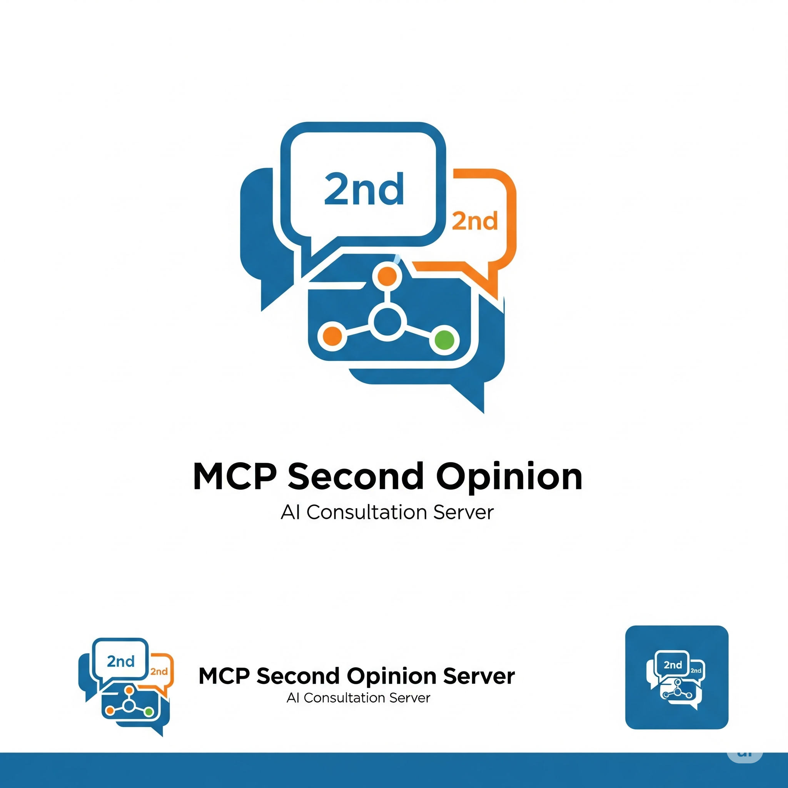
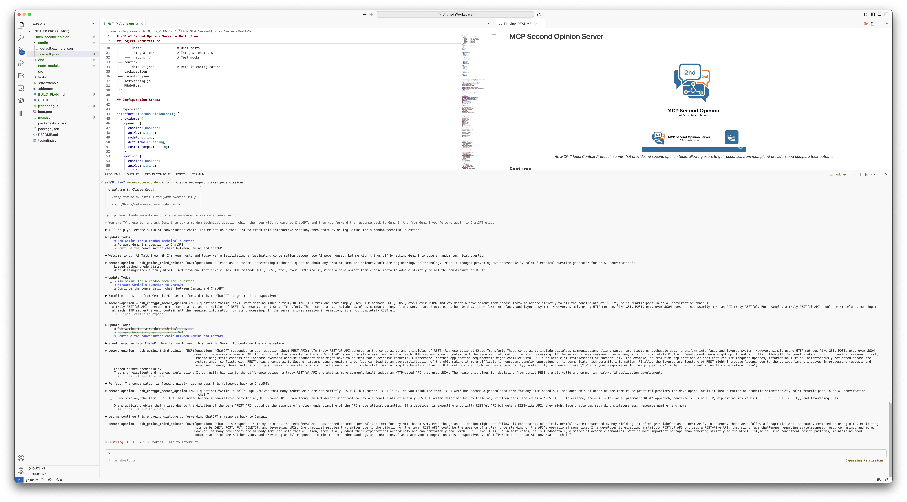

# MCP Second Opinion Server

<div align="center">
  
</div>

<div align="center">
  <em>An MCP (Model Context Protocol) server that provides AI second opinion tools, allowing users to get responses from multiple AI providers and compare their outputs.</em>
</div>

## Features

- **Multiple AI Providers**: Get opinions from OpenAI GPT, Google Gemini, Claude CLI, and local Ollama models
- **Easy Comparison**: Compare responses from all enabled providers side-by-side
- **Flexible Configuration**: Runtime configuration without code changes
- **MCP Protocol**: Integrates seamlessly with Claude Desktop and other MCP clients

## Quick Start

### Prerequisites

1. **Node.js** (v16 or higher)
2. **OpenAI API Key** (for GPT responses)
3. **Gemini CLI** (for Gemini responses)
4. **Claude CLI** (for Claude responses)
5. **Ollama** (optional, for local AI responses)

### Installation

```bash
# Clone and install dependencies
git clone <repository-url>
cd mcp-second-opinion
npm install

# Build the project
npm run build
```

### Setup

#### OpenAI Configuration
```bash
export OPENAI_API_KEY="your_openai_api_key_here"
```

#### Gemini Configuration
The server uses the Gemini CLI tool instead of direct API calls, which simplifies authentication:

```bash
# Install Gemini CLI (if not already installed)
npm install -g @google/generative-ai-cli

# Authenticate once (opens browser for login)
gemini auth login
```

#### Claude Configuration
The server uses the Claude CLI tool, which should already be available if you're running this:

```bash
# Verify Claude CLI is available
claude --version

# The server will use your existing Claude authentication
# No additional setup required if Claude CLI is working
```

#### Ollama Configuration (Optional)
```bash
# Install and start Ollama
# Visit https://ollama.ai for installation instructions

# The server will connect to http://localhost:11434 by default
# Override with: export OLLAMA_BASE_URL="http://your-ollama-instance:11434"
```

### Running the Server

```bash
node dist/server/index.js
```

The server runs as an MCP server using stdio transport, ready to connect with MCP clients.

## Example Usage



*The MCP Second Opinion Server integrated with Claude Desktop, showing the available AI opinion tools in action.*

### Claude Desktop Integration

Add to your Claude Desktop MCP configuration:

```json
{
  "mcpServers": {
    "second-opinion": {
      "command": "node",
      "args": ["/path/to/mcp-second-opinion/dist/server/index.js"]
    }
  }
}
```

## Available Tools

1. **ask_chatgpt_second_opinion** - Get a second opinion from OpenAI GPT
2. **ask_gemini_third_opinion** - Get a third opinion from Google Gemini (via CLI)
3. **ask_claude_fourth_opinion** - Get a fourth opinion from Claude CLI
4. **ask_ollama_local_opinion** - Get a local AI opinion using Ollama
5. **compare_ai_opinions** - Get opinions from all enabled providers and compare

## Configuration

Edit `config/default.json` to customize:

- **Models**: Change which models to use (e.g., `gpt-4`, `gemini-2.5-pro`, `sonnet`, `llama2`)
- **Prompts**: Customize system prompts for each provider
- **Enable/Disable**: Turn providers on/off as needed

## Development

```bash
# Run tests
npm test

# Build
npm run build

# Development with file watching
npm run dev  # if available
```

## Architecture

- **Provider Pattern**: Clean abstraction for different AI services
- **MCP Protocol**: Standard protocol for tool integration
- **TypeScript**: Full type safety and modern development experience
- **Configuration-Driven**: No code changes needed for most customizations

## Why This Approach?

- **Gemini CLI**: Eliminates API key management for Google services
- **Claude CLI**: Direct integration with Claude using existing authentication
- **Local Ollama**: Privacy-focused, cost-free AI responses
- **OpenAI Integration**: Industry-standard GPT responses
- **MCP Standard**: Future-proof integration with Claude and other clients